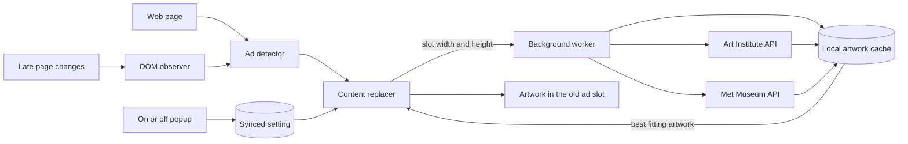

# Ads Art

Ads Art is a browser extension that finds ad slots and fills them with paintings from the Art Institute of Chicago and The Metropolitan Museum of Art. Hover over a painting to see its title, artist, date, and museum.

## How it works

### 1. Detect the slot

`content/detector.js` looks for known ad technology, including Google ad slots, common ad-network iframes, Taboola, Outbrain, `amp-ad`, and similar elements.

It also checks first-party containers such as `ad-container`. Word boundaries matter here: a class such as `masthead-container` should not be mistaken for an ad. A final size check recognizes common IAB-shaped slots only when the element also has an ad hint.

Headers, navigation bars, search areas, and other site controls are protected from replacement.

### 2. Watch for late arrivals

Many sites insert ads after the page has loaded. `content/observer.js` watches new DOM nodes, waits 200 ms for a batch of changes to settle, and scans only the new material.

### 3. Find a fitting painting

The content script sends the slot width and height to `background/service-worker.js`. The worker searches two public museum APIs and sorts results into landscape, portrait, and square caches.

The closest aspect ratio wins. Recently shown pieces are skipped, and the worker alternates museums when it can.

### 4. Fit the image into the old space

`content/replacer.js` builds the replacement with DOM methods. Museum titles and artist names are inserted as text, so API metadata cannot become page markup.

Art Institute images use IIIF resizing and a centered crop when the artwork and ad slot have very different shapes. Met images use the smaller web image for ordinary slots and the full image for larger ones.

### 5. Keep the page stable

Replacements run through one queue, one at a time. The original slot dimensions stay in place, which reduces page jumping while the painting loads.

## System design



There are two kinds of storage:

- `chrome.storage.sync` holds the on/off switch;
- `chrome.storage.local` holds artwork metadata, split by shape, for up to seven days.

The project has no Ads Art server. Museum searches go directly from the extension worker to the public museum APIs, and images load from museum image hosts.

## Privacy and permissions

Ad detection happens inside the current tab. Page markup and browsing history are not uploaded to an Ads Art backend because the project does not have one.

The extension does make network requests for paintings. Its declared host permissions are limited to:

```text
https://api.artic.edu/*
https://collectionapi.metmuseum.org/*
```

Artwork images then load from the museums' image hosts. Normal request metadata may still be visible to those hosts.

The content scripts run on `<all_urls>` so they can find ad slots on ordinary websites. The only extension permission is `storage`, used for the toggle and artwork cache.

## Development

The extension uses plain JavaScript, HTML, and CSS. There is no npm install step.

Requirements:

- a Chromium-based browser or Firefox;
- Bash;
- Python 3, used by the release script to read the version;
- `zip`, used to create browser packages.

### Useful checks

```bash
jq empty manifest.json manifest.firefox.json
bash -n build.sh
./build.sh
```

There is no automated test suite yet. A practical manual check covers:

1. An ad already present when the page opens;
2. an ad inserted after the page loads;
3. a page header or navigation bar that must stay untouched;
4. the artwork caption on hover;
5. the popup toggle after a page reload.

## Credits

Artwork and metadata come from the open-access programs of the [Art Institute of Chicago](https://www.artic.edu/open-access) and [The Metropolitan Museum of Art](https://www.metmuseum.org/art/collection/search-open-access). The museums retain their respective image and metadata rights.

## License

Ads Art is licensed under the [GNU General Public License version 3](LICENSE).
